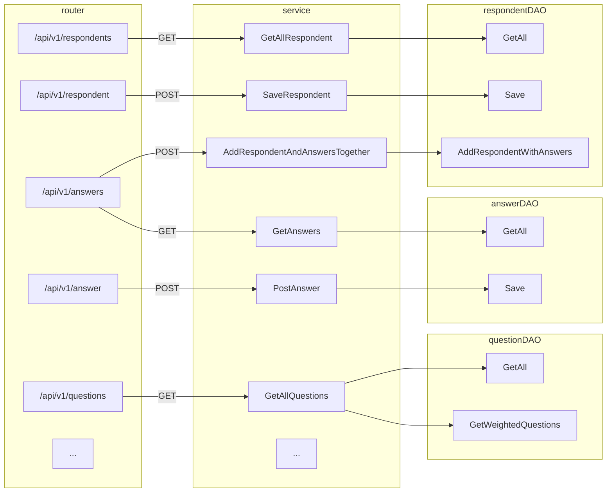

# singlish-words-backend

[GitHub - SinglishWords/singlish-words-backend: Singlish Words Application's Backend Code](https://github.com/SinglishWords/singlish-words-backend)

This repository consists of the working files for the backend of the SinglishWords project, written primarily in Go. The backend serves an API that provides random cues, updates answers and respondents into the MySQL database.

# Installation

To deploy the SinglishWords frontend on your local system, open your terminal and first clone the repository

```bash
$ git clone https://github.com/SinglishWords/singlish-words-backend.git
$ cd singlish-words-backend # to enter the directory
```

# Setup MySQL and Redis

## Installing MySQL and Redis

Running and testing the backend on your [localhost](http://localhost) requires the installation of MySQL and Redis. The easiest way to install these is using Homebrew.

```bash
$ brew install mysql
$ brew install redis
```

## Initialise MySQL

If you have already initialised MySQL before, you can skip this step.

After installing MySQL using `brew`, run the following command to initialise.

```bash
$ mysqld --initialize
```

Take note of the temporary password that is generated once this command is run. The username to access MySQL will be `root` and the password will be the random generated password.

To run MySQL, run the following command

```bash
$ mysql -u root -p YOUR_PASSWORD
```

## Set up MySQL for testing

In order to use MySQL with the backend server, you can use the `setup_db.sh` provided in the root directory. Run the following command:

```bash
$ ./setup_db.sh
```

This will ask for your MySQL password. After entering your password, the script will:

1. Update the `config.yaml` file to change the username and password that the server will use to communicate with MySQL
2. Create a database on your local MySQL server called `singlishwords`
3. Within the `singlishwords` database, it will create the following tables
    
    ```mermaid
    classDiagram
    class respondent {
    	int id
    	int age
    	string gender
    	string education
    	string country_of_birth
    	string country_of_residence
    	string ethnicity
    	string uuid
    	string is_native
    	text language_spoken
    	datetime start_time
    	datetime end_time
    }
    class question {
    	string id
    	string word
    	int enable
    	int count
    }
    class answer {
    	int id
    	string association1
    	string association2
    	string association3
    	int time_spend
    	int question_id
    	int respondent_id
    }
    class email {
    	string email
    	string want_lucky_draw
    	string want_update
    	text time_on_pages
    }
    ```
    
4. Within the `question` table, it will add 3000 test entries (cues). In order to change the cues added, you can modify the `./sql/questions-test-data.sql` file.

# Starting the server

First, start the Redis server in one shell window using

```bash
$ redis-server
```

Then, start the backend server by running

```bash
$ make run
```

 The server will start on [localhost:8080](http://localhost:8080).

# API & Functionality

The API is accessible at [singlishwords.nus.edu.sg/api/v1](http://singlishwords.nus.edu.sg/api/v1)

API controller (`./controller/apiv1`) calls services (`./service`) which uses the DAO (`./dao`) to read, update, or write to the MySQL database.

The backend serves the following API endpoints:

| URL | Type | Parameters | Description |
| --- | --- | --- | --- |
| / | GET |  | shows a summary of the three other GET endpoints |
| /questions | GET | limit | returns limit weighted random questions in JSON format |
| /answers | GET |  | returns all answers in JSON |
| /answer | POST | answer's attributes | updates the database with the completed responses only |
| /respondents | GET |  | returns all respondents in JSON |
| /respondent | POST | respondent's attributes | updates the database with the respondent details only |
| /answers | POST | respondent's and answer's attributes | updates the database with the answers + the respondent details |
| /email | POST | email's attributes | updates the database with the email |



## “GetAll()” functions

The `respondent`, `question` and `answer` services have `GetAll()` methods, that retrieve all entries of their respective tables in the database.

1. For example, the service `respondent` has a `GetAllRespondents()` function
2. [1] calls `respondentDAO.GetAll()`
3. [2] runs the SQL query `SELECT * FROM respondent;` and the `model.Respondent` object automatically converts this into a collection of `model.Respondent` object.
4. The collection `[]model.Respondent` is converted to JSON 
5. The JSON is returned with the code 200 (OK)

## Selecting random weighted questions

In order to ensure that there is an equal distribution of responses for each cue, the selection query must be more biased towards cues with fewer responses.

In `questionDAO`, the `GetWeightedQuestions(limit int)` method retrieves `limit` weighted random questions using weighted reservoir sampling:

$$
f(q)=\frac{-\log(\textrm{rand}([0,1]))}{\textrm{count}(q)}
$$

by taking the top `limit` entries in the table sorted by the $f$ value.

This is equivalent to using the SQL query `SELECT * FROM question ORDER BY -LOG(RAND()) / count DESC LIMIT ?;`

## Updating answers and respondents

Answers and respondents can be updated in the database either individually or concurrently.

### Individually

The `answer` and `respondent` services each have a method `PostAnswer()` and `AddRespondent()` which, when run, converts the POST parameters into a data model object and passes it to the respective DAO’s `Save()` method.

1. For example, `AddRespondent()` converts the POST params to a `model.Respondent`
2. This object is passed to the `respondentDAO.save(*mode.Respondent)` method
3. This method uses the SQL update `INSERT INTO respondent (...) VALUES (...)`
4. Returns HTTP status 201 (Created)

For example, `respondentDAO.save(*model.Respondent)` 

### Concurrently

The `respondent` service has an extra method `AddRespondentAndAnswersTogether()`. 

The POST params are converted into two separate model objects (`model.Respondent`, `model.Answer`) and passed to the above method.

The database update is treated as a transaction. The transaction is created using `tx = db.Beginx()`

If both SQL commands to update the transaction are successful, the transaction is committed using `tx.Commit()`

# Next steps

At this point, the changes can be committed and pushed to the `master` branch of this repo. 

Remember to not commit private data such as your MySQL credentials in the `config.yaml` file. As a precaution, this file has been added to the `.gitignore`.

The next steps include:

1. Making changes to the fronted, if any ([refer to this link](https://github.com/SinglishWords/singlish-words-frontend))
2. Deploying the whole application in a Docker container ([refer to this link](https://github.com/SinglishWords/deployment))